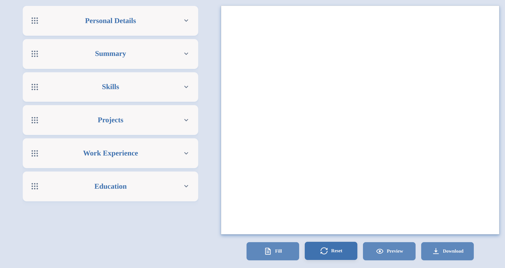
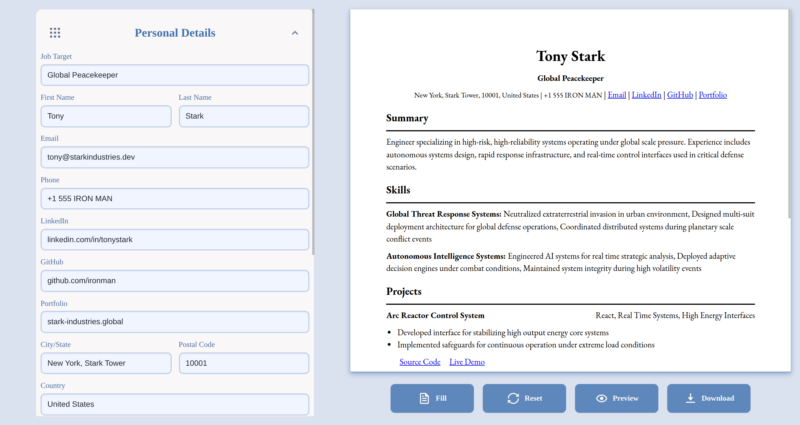
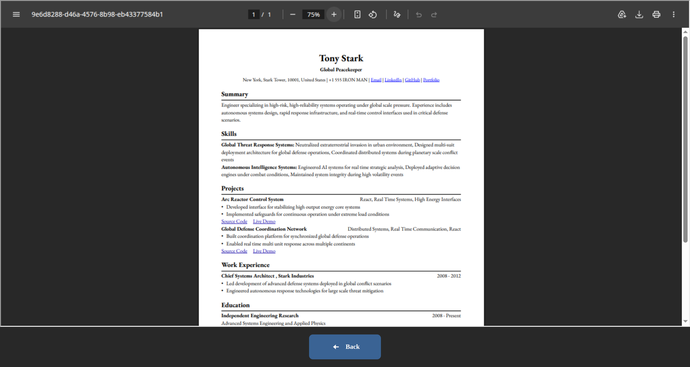

# Project: CV Application

## Overview

A CV/Résumé Builder built as part of The Odin Project's React curriculum. Users can enter their personal information, education, and work experience to generate a professional résumé with real-time updates while practicing core React concepts.

[Odin CV Application](https://krig6.github.io/odin-cv-application/) - Because every professional deserves a well-rendered first impression.

## Technologies Used

- **React:** https://react.dev — Component-based UI library
- **Vite:** https://vitejs.dev — Fast build tool and development server
- **Zustand:** https://zustand-demo.pmnd.rs — Lightweight state management
- **@dnd-kit (core / sortable / utilities):** https://dndkit.com — Drag-and-drop interactions and sorting
- **@react-pdf/renderer:** https://react-pdf.org — Generate downloadable PDF résumés
- **Boxicons React:** Icon library for UI elements
- **Pluralize:** String pluralization utilities
- **ESLint:** Code linting and static analysis tool
- **gh-pages:** GitHub Pages deployment utility

## Features

- **Live CV Preview:** Instantly see changes reflected in the résumé preview as you edit your information.
- **Personal Information Management:** Easily add and update contact details, professional summary, and other personal information.
- **Flexible Section Management:** Create, edit, remove, and organize multiple education, work experience, project, and skills entries.
- **Drag-and-Drop Reordering:** Rearrange résumé sections and entries through an intuitive drag-and-drop interface powered by DnD Kit.
- **Dynamic Form Management:** Add, update, or remove entries with a responsive and user-friendly form system.
- **State Management with Zustand:** Centralized application state ensures a smooth editing experience and consistent data flow.
- **PDF Export:** Generate a professionally formatted résumé as a downloadable PDF using React PDF.
- **Responsive Design:** Optimized for both desktop and mobile devices for seamless editing across screen sizes.
- **Modern User Interface:** Clean, professional layout designed to keep the focus on content while providing an intuitive user experience.
- **Component-Based Architecture:** Built with reusable React components for maintainability and scalability.
- **One-Click Sample CV:** Instantly populate all sections with sample data to preview the résumé design and functionality.

## Screenshots

## Learning Path

This project was my first experience with React. At first, the React way of building applications felt confusing, but after spending time with it, the concepts started to click.

One realization I had was that React's component-based approach is very similar to the modular design I used in my Restaurant Page project. Instead of building entire pages at once, you create smaller reusable components and compose them together to form the final interface. Understanding props and how data flows between components helped me see why React is such a popular choice for modern web development.

Working on this project also showed me how productive React can be. Even with my current experience level, I was able to build a fairly complete application, which made me excited about what I can create as my skills continue to grow.

The biggest challenges were implementing smooth drag-and-drop interactions and designing the PDF preview/export layout. Both required a lot of experimentation and refinement before they felt right. Although these parts were challenging, they were also the most rewarding because I could see the application gradually take shape.

Another valuable lesson was learning when to combine and refactor similar components into reusable ones. As the project grew, reducing duplication became increasingly important for keeping the codebase organized and maintainable.

For my next project, I plan to explore TypeScript and Tailwind CSS. They are tools I frequently see used in modern React applications, and I'm interested in learning firsthand how they can improve the development experience.

## Customization

- Modify the styling and color scheme to match your preferences.
- Adjust the PDF layout and typography.
- Add or remove résumé sections such as certifications, awards, or languages.
- Extend existing components or create new ones to support additional features.
- Replace the sample data with your own defaults.

## Contributing

Contributions are welcome!

If you’d like to improve this project:

1. Fork the repo
2. Create a feature branch
3. Make your changes
4. Test your updates
5. Open a pull request describing what you changed

### Resources and Tools

- [The Odin Project](https://www.theodinproject.com/) – Guided full-stack curriculum that inspired the project structure.
- [Neovim](https://neovim.io/) – Text editor used for coding and workflow efficiency.
- [Google Fonts](https://fonts.google.com/) – Font resources for UI styling.
- [Flaticon](https://www.flaticon.com/) – Used for the favicon.
